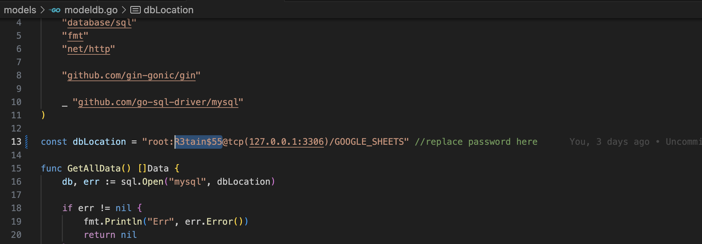
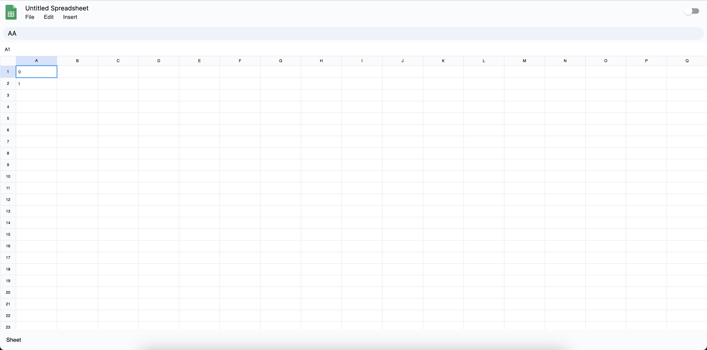
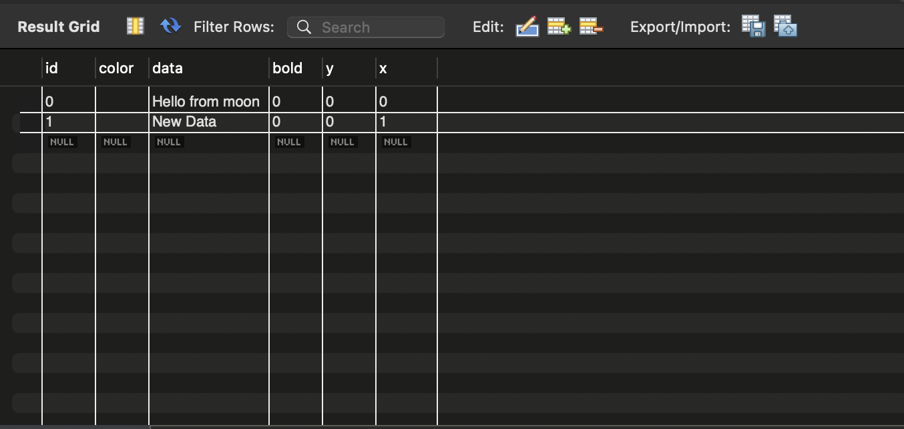
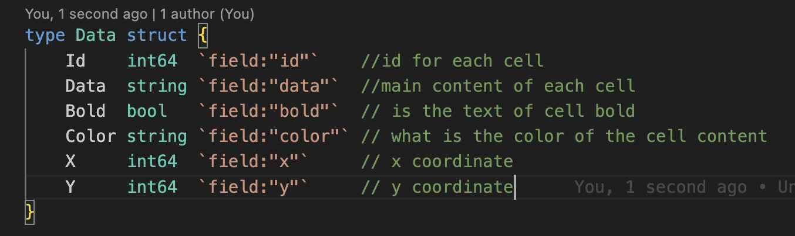

## Google Sheets Clone

### Run Project

Front End (https://github.com/superstark02/google-sheets-clone.git):

Front-end is built on NextJS framework, for API calls [TanStack Query](https://tanstack.com/) is used.

```bash
git clone https://github.com/superstark02/google-sheets-clone.git

cd google-sheets-clone

npm i

npm run dev
```

Back End (https://github.com/superstark02/google-sheets-clone-be.git):


```bash
git clone https://github.com/superstark02/google-sheets-clone-be.git

cd google-sheets-clone-be

go run .
```

Make sure that [MySQL](https://www.mysql.com/downloads/) installed and run MySQL server on port [localhost:3306 ](http://localhost:3306) and replace your MySQL password in **mongodb.go**



Open [http://localhost:3000](http://localhost:3000) with your browser to see the result.

## The UI looks like this


## Here is the basic schema of the database




To generate ID for each row **Cantor Pairing** was used. This function generates a unique ID from two given number i.e. X,Y coordinates in this case.

```javascript
//Cantor pairing function
const cantorPairing = (n: number, m: number) => {
  return ((n + m) * (n + m + 1)) / 2 + m;
};
```